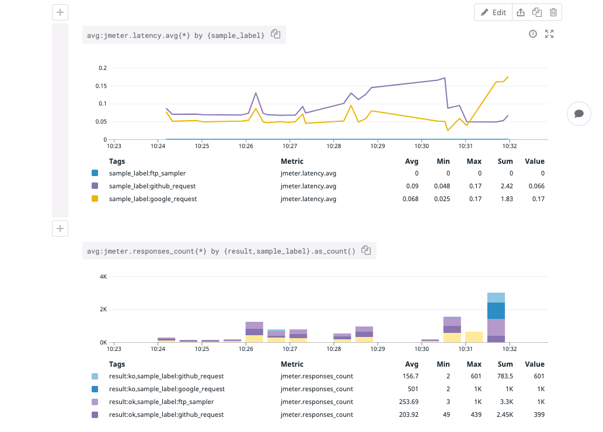

# Datadog Backend Listener for Apache JMeter

## Overview
Datadog Backend Listener for Apache JMeter is a JMeter plugin used to send test results to the Datadog platform. It includes the following features:
- Real time reporting of test metrics (latency, bytes sent and more. See the `metrics` section.
- Real time reporting of test results as Datadog log events.
- Ability to include sub results.

## Configuration

To start reporting metrics and logs to the Datadog platform, add a `Backend Listener` to your JMeter test and set the `Backend Listener implementation` to `org.datadog.jmeter.plugins.DatadogBackendClient`.

The plugin has the following configuration options:

| Name       | Required | Default value | description|
|------------|:--------:|---------------|------------|
|apiKey | true | NA | Your Datadog API key.|
|datadogUrl | false | https://api.datadoghq.com/api/ | You can configure a different endpoint, for instance https://api.datadoghq.eu/api/ if your datadog instance is in the EU|
|logIntakeUrl | false | https://http-intake.logs.datadoghq.com/v1/input/ | You can configure a different endpoint, for instance https://http-intake.logs.datadoghq.eu/v1/input/ if your datadog instance is in the EU|
|metricsMaxBatchSize|false|200|Metrics are submitted every 10 seconds in batches of size `metricsMaxBatchSize`|
|logsBatchSize|false|500|Logs are submitted in batches of size `logsBatchSize` as soon as this size is reached.|
|sendResultsAsLogs|false|false|By default only metrics are reported to Datadog. To report individual test results as log events, set this field to `true`.|
|includeSubresults|false|false|A subresult is for instance when an individual HTTP request has to follow redirects. By default subresults are ignored.|

## Contributing

### Reporting a bug and feature requests
- **Ensure the bug was not already reported**
- If you're unable to find an open issue addressing the problem, [open a new one](https://github.com/DataDog/jmeter-datadog-backend-listene/issues/new).
- If you have a feature request, it is encouraged to contact the [Datadog support](https://docs.datadoghq.com/help) so the request can be prioritized and properly tracked.
- **Do not open an issue if you have a question**, instead contact the [Datadog support](https://docs.datadoghq.com/help).

### Pull requests
Have you fixed an issue or adding a new feature? Many thanks for your work and for letting other to benefit from it.

Here are some generic guidelines:
- Avoid changing too many things at once.
- **Write tests** for the code you wrote.
- Make sure **all tests pass locally**.
- Summarize your PR with a **meaningful title** and **write a meaningful description for it**.

Your pull request must pass the CI before we can merge it. If you're seeing an error and don't think it's your fault, it may not be. Let us know in the PR and we'll get it sorted out.
